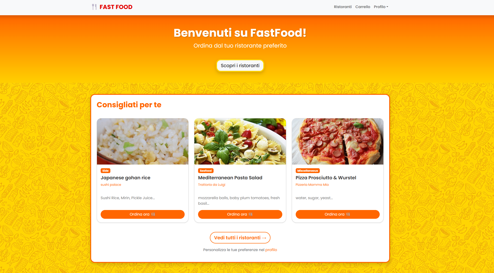

# 🍕 FastFood Delivery Platform

Un sistema completo per la gestione di un'app di delivery di cibo con frontend web e API REST backend.



## 📋 Indice

- [Panoramica](#panoramica)
- [Architettura](#architettura)
- [Installazione](#installazione)
- [Uso](#uso)
- [API Documentation](#api-documentation)
- [Funzionalità](#funzionalità)
- [Tecnologie](#tecnologie)

---

## 🎯 Panoramica

FastFood Delivery Platform è una soluzione completa che permette:

- **👥 Clienti**: Registrazione, esplorazione menu, carrello, ordini
- **🏪 Ristoranti**: Gestione menu, ricezione ordini, sistema timer automatico
- **⚡ Sistema Timer**: Gestione automatica stati ordini con notifiche real-time
- **🔐 Autenticazione**: JWT con controllo ruoli (cliente/ristorante)

---

## 🏗️ Architettura

```
progetto-fastfood/
├── client/                 # Frontend web (HTML/CSS/JS)
│   ├── index.html         # Homepage
│   ├── login.html         # Login page
│   ├── registrazione.html # Registrazione utenti
│   ├── cliente/           # Interfacce cliente
│   │   ├── carrello.html  # Gestione carrello
│   │   ├── menu.html      # Menu ristorante
│   │   ├── ordini.html    # Storico ordini cliente
│   │   ├── profilo.html   # Profilo utente
│   │   └── ristoranti.html # Lista ristoranti
│   ├── ristorante/        # Interfacce ristorante
│   │   ├── dashboard.html # Dashboard ristorante
│   │   ├── menu.html      # Gestione menu
│   │   ├── ordini.html    # Ordini ricevuti
│   │   └── profilo.html   # Profilo ristorante
│   ├── css/
│   │   └── style.css      # Styling Bootstrap
│   ├── js/                # JavaScript modules
│   │   ├── api.js         # Wrapper API calls
│   │   ├── auth.js        # Gestione autenticazione
│   │   ├── cart.js        # Logica carrello
│   │   ├── config.js      # Configurazione globale
│   │   ├── dashboard.js   # Dashboard ristorante
│   │   ├── home.js        # Homepage
│   │   ├── imageUpload.js # Upload immagini
│   │   ├── login.js       # Login/logout
│   │   ├── menu.js        # Gestione menu
│   │   ├── ordini.js      # Sistema ordini
│   │   ├── profilo.js     # Gestione profilo
│   │   ├── registrazione.js # Registrazione
│   │   ├── ristoranti.js  # Lista ristoranti
│   │   └── utils.js       # Utility functions
│   └── img/               # Immagini statiche
│
├── docs-progetto/         # Documentazione progetto
└── server/                # Backend API (Node.js)
    ├── app.js            # Entry point server
    ├── package.json      # Dipendenze npm
    ├── meals.json        # Dati piatti di esempio
    ├── importMeals.js    # Script import piatti
    ├── api/              # Route handlers
    │   ├── cartAPI.js    # Gestione carrello
    │   ├── mealsAPI.js   # Gestione piatti
    │   ├── menuAPI.js    # Menu ristoranti
    │   ├── orderAPI.js   # Sistema ordini + timer
    │   ├── restaurantsAPI.js # Gestione ristoranti
    │   ├── uploadAPI.js  # Upload immagini
    │   └── userAPI.js    # Autenticazione utenti
    ├── config/
    │   └── db.js         # Configurazione MongoDB
    ├── docs/             # Swagger documentation
    │   ├── swagger.js    # Generazione docs
    │   └── swagger.json  # API documentation
    ├── models/           # Mongoose schemas
    │   ├── cartModel.js  # Schema carrello
    │   ├── mealModel.js  # Schema piatti
    │   ├── orderModel.js # Schema ordini
    │   └── userModel.js  # Schema utenti
    ├── uploads/          # Immagini caricate
    ├── utils/            # Utilities
    │   ├── argon2.js     # Hash password
    │   ├── jwt.js        # JWT tokens
    │   └── orderTimer.js # Timer ordini
    └── validators/
        └── userValidators.js # Validazione input
```

---

## 🚀 Installazione

### Prerequisiti
- **Node.js** v16+ 
- **MongoDB** (locale o cloud)
- **npm** o **yarn**

### Setup Backend

```bash
# 1. Clone repository e vai nella directory server
cd server

# 2. Installa dipendenze
npm install

# 3. Crea file environment (.env)
# Crea un file .env nella cartella server con:

# 4. Avvia il server in modalità sviluppo
npm run dev
```

### Setup Frontend

```bash
# Il frontend è servito automaticamente dal server Express
# Accessibile su: http://localhost:3000
```

### Variables d'Ambiente (.env)

```bash
# Database
MONGODB_URI=mongodb://localhost:27017/fastfood-app

# JWT Security  
JWT_SECRET=your-super-secret-key-here

# Server
PORT=3000
NODE_ENV=development
```

---

## 🎮 Uso

### Avvio Rapido

```bash
# Terminal 1: Avvia MongoDB (se locale)
mongod

# Terminal 2: Avvia il backend
cd server
npm run dev

# Browser: Vai su http://localhost:3000
```

### Flusso Utente Tipico

1. **Registrazione**: `http://localhost:3000/registrazione.html`
2. **Login**: `http://localhost:3000/login.html` 
3. **Esplora Ristoranti**: `http://localhost:3000/cliente/ristoranti.html`
4. **Menu Ristorante**: `http://localhost:3000/cliente/menu.html`
5. **Gestisci Carrello**: `http://localhost:3000/cliente/carrello.html`
6. **Effettua Ordine**: Checkout dal carrello
7. **Monitora Ordini**: `http://localhost:3000/cliente/ordini.html`

---

## 📡 API Documentation

### 🔐 Authentication

| Endpoint | Method | Descrizione | Auth |
|----------|---------|-------------|------|
| `/register` | POST | Registrazione utente | ❌ |
| `/login` | POST | Login utente | ❌ |
| `/logout` | POST | Logout utente | ✅ |

**Esempio Registrazione Cliente:**
```javascript
POST /register
Content-Type: application/json

{
  "ruolo": "cliente",
  "nome": "Mario", 
  "cognome": "Rossi",
  "email": "mario@example.com",
  "password": "password123",
  "telefono": "1234567890",
  "preferenze": ["italiana", "pizza"]
}
```

**Esempio Registrazione Ristorante:**
```javascript
POST /register
Content-Type: application/json

{
  "ruolo": "ristorante",
  "nomeRistorante": "Pizza Palace",
  "partitaIVA": "12345678901",
  "email": "pizzapalace@example.com", 
  "password": "password123",
  "telefono": "0987654321",
  "indirizzo": "Via Roma 123",
  "categoria": "italiana",
  "descrizione": "Pizzeria tradizionale"
}
```

### 🛒 Carrello (Solo Clienti)

| Endpoint | Method | Descrizione | Auth |
|----------|---------|-------------|------|
| `/cart` | GET | Visualizza carrello | ✅ Cliente |
| `/cart/add` | POST | Aggiungi al carrello | ✅ Cliente |
| `/cart/update/:itemId` | PATCH | Modifica quantità | ✅ Cliente |  
| `/cart/remove/:itemId` | DELETE | Rimuovi dal carrello | ✅ Cliente |
| `/cart/clear` | DELETE | Svuota carrello | ✅ Cliente |

**Esempio Aggiunta Carrello:**
```javascript
POST /cart/add
Content-Type: application/json
Cookie: token=jwt_token_here

{
  "piattoId": "64f8a123456789abcdef1234",
  "quantita": 2,
  "note": "Extra cheese, no onions"
}
```

### 📋 Ordini

#### Cliente
| Endpoint | Method | Descrizione | Auth |
|----------|---------|-------------|------|
| `/orders/create` | POST | Crea ordine da carrello | ✅ Cliente |
| `/orders/mine` | GET | I miei ordini | ✅ Cliente |
| `/orders/:id` | GET | Dettaglio ordine | ✅ Cliente |
| `/orders/:id/cancel` | PATCH | Cancella ordine | ✅ Cliente |
| `/orders/:id/mark-delivered` | PATCH | Conferma consegna | ✅ Cliente |

#### Ristorante  
| Endpoint | Method | Descrizione | Auth |
|----------|---------|-------------|------|
| `/orders/restaurant` | GET | Ordini ristorante | ✅ Ristorante |
| `/orders/:id/status` | PATCH | Cambia stato | ✅ Ristorante |
| `/orders/:id/start-preparation` | PATCH | Avvia timer | ✅ Ristorante |

**Esempio Creazione Ordine:**
```javascript
POST /orders/create
Content-Type: application/json
Cookie: token=jwt_token_here

{
  "metodoPagamento": {
    "tipo": "carta",
    "circuito": "visa",
    "numeroMascherato": "**** **** **** 1234"
  }
}
```

**Esempio Avvio Timer Preparazione:**
```javascript
PATCH /orders/:id/start-preparation
Content-Type: application/json
Cookie: token=jwt_token_here

{
  "tempoAttesa": 30  // minuti (1-120)
}
```

### 🍕 Menu & Pasti

| Endpoint | Method | Descrizione | Auth |
|----------|---------|-------------|------|
| `/meals` | GET | Lista tutti i pasti | ❌ |
| `/meals/:id` | GET | Dettaglio pasto | ❌ |
| `/restaurants` | GET | Lista ristoranti | ❌ |
| `/restaurants/:id/menu` | GET | Menu ristorante | ❌ |

---

## ⚙️ Sistema Timer Ordini

### 🔄 Stati Ordini

```
ordinato → in preparazione → pronto → consegnato(final)
    ↓              ↓           ↓
 cancellato(final)    timer_attivo  timer_scaduto
```

### ⏰ Funzionamento Timer

1. **Cliente ordina** → Stato: `ordinato`
2. **Ristorante avvia preparazione** → Stato: `in preparazione` + Timer START
3. **Timer automatico** → Dopo X minuti → Stato: `pronto`  
4. **Cliente conferma ritiro** → Stato: `consegnato`

### 📊 Monitoraggio Timer

Il sistema usa **node-cron** per controlli automatici ogni minuto:

```javascript
// Esegue ogni minuto
cron.schedule('* * * * *', () => {
  // controlla ordini "in preparazione" scaduti
  // aggiorna automaticamente a "pronto" 
  // invia notifiche (se configurate)
});
```

---

## ✨ Funzionalità Principali

### 🔐 Sistema Autenticazione

- **JWT Tokens** con HTTP-only cookies
- **Hash Password** con Argon2 
- **Controllo Ruoli** (cliente/ristorante)
- **Middleware protezione** rotte

### 🛒 Gestione Carrello

- **Multi-ristorante** (un carrello per ristorante)
- **Quantità dinamiche** e note personalizzate
- **Calcolo totale** automatico
- **Persistenza database** 

### 📋 Sistema Ordini Avanzato

- **Creazione automatica** da carrello
- **Stati multipli** con transizioni controllate
- **Timer automatici** per preparazione
- **Notifiche stato** (pronto per implementazione)

### ⏱️ Timer Intelligente

- **Calcolo automatico** tempo preparazione
- **Monitoraggio background** con cron jobs
- **Transizioni automatiche** di stato
- **Gestione scadenze** e timeout

### 📊 Dashboard Ristorante

- **Vista ordini** in tempo reale
- **Controllo preparazione** con timer
- **Gestione stati** ordini
- **Statistiche** (pronto per implementazione)

---

## 🛠️ Tecnologie

### Backend
- **Node.js** - Runtime JavaScript
- **Express.js** - Web framework  
- **MongoDB** - Database NoSQL
- **Mongoose** - ODM per MongoDB
- **JWT** - Autenticazione stateless
- **Argon2** - Hash password sicuro
- **node-cron** - Scheduler background jobs
- **Swagger** - Documentazione API

### Frontend  
- **HTML5/CSS3** - Markup e styling
- **Bootstrap 5** - Framework CSS responsive
- **Vanilla JavaScript** - Interattività client-side
- **Fetch API** - Chiamate HTTP asincrone

### DevOps
- **Nodemon** - Hot reload development
- **ESLint** - Code linting
- **Prettier** - Code formatting

---

## 🚧 Sviluppi Futuri

###  Priorità Alta
- [ ] **Hide/show password** nella registrazione e login
- [ ] **Fixare il footer** cosi che rimanga fissato in basso
- [ ] **Categorie custom** per i piatti unici dei ristoranti
- [ ] **card del menu cliccabili/selezionabili** migliora il flow
- [ ] **nomi delle tabs** renderle inerenti alla pagina.
- [ ] **optional preferenze** modal nella registrazione utente
- [ ] **pulire storico ordini** e filtro per stato

###  Funzionalità Avanzate
- [ ] **Consegna a domicilio** (solo ritiro disponibile)
- [ ] **Geolocalizzazione** e tracking consegne
- [ ] **Sistema recensioni** e rating
- [ ] **Dashboard analytics** per ristoranti
- [ ] **App mobile** (React Native)

### Altro 
- [ ] **Personalizzazione profilo utente** upload img profilo
- [ ] **Sistema notifiche** real-time (WebSocket)
---

## 🏆 Status Progetto


**✅ Sistema funzionante** per tutte le funzionalità core  
**📱 Frontend** completamente connesso alle API  
**⚡ Sistema timer** completamente operativo  

---

*Ultima modifica: 23 Febbraio 2026*

## 🍴 Descrizione
Piattaforma di food delivery con gestione ordini, carrello e timer automatici.

## ⚙️ Tecnologie
- Backend: Node.js, Express, MongoDB
- Autenticazione: JWT + Argon2
- Timer: node-cron per ordini automatici

## 🚀 Installazione
1. Clona il repo: `git clone ...`
2. Installa dipendenze: `cd server && npm install`
3. Crea file .env con le variabili necessarie
4. Avvia: `npm run dev`

## 📡 API Endpoints
- Vedi Swagger docs su http://localhost:3000/api-docs
- Import Postman collection da postman_collection.txt

## 🔐 Sicurezza
- Password hashate con Argon2
- JWT con HTTP-only cookies
- Validazione input con express-validator

## ✨ Funzionalità Uniche
- Timer automatico per cambio stato ordini
- Gestione ruoli cliente/ristorante
- Sistema carrello avanzato